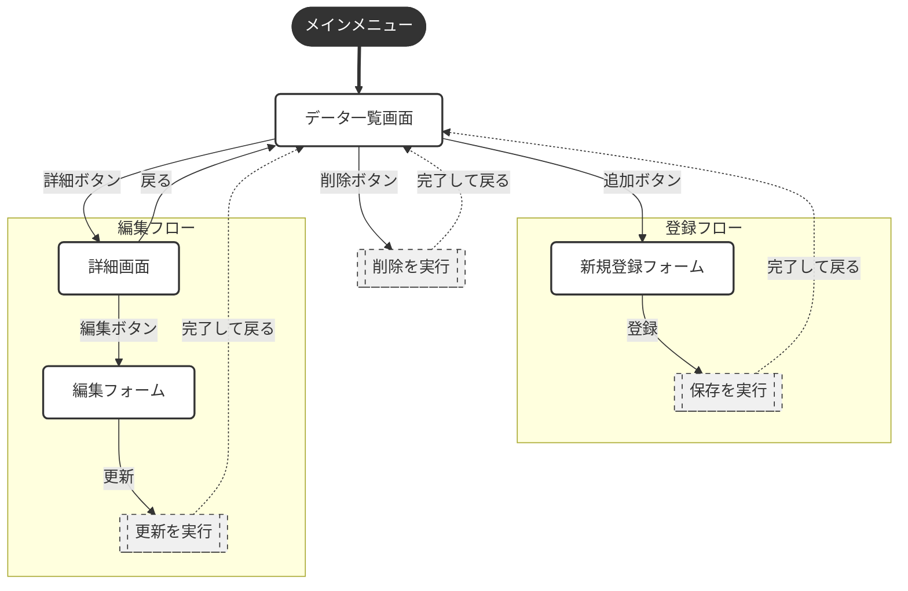

```mermaid
graph TD
    %% デザイン設定
    classDef screen fill:#fff,stroke:#333,stroke-width:2px,rx:5,ry:5;
    classDef process fill:#f0f0f0,stroke:#333,stroke-width:1px,stroke-dasharray: 5 5,rx:5,ry:5;
    classDef start fill:#333,stroke:#333,stroke-width:2px,color:#fff,rx:10,ry:10;

    %% ノード定義
    Menu([メインメニュー]):::start
    List[データ一覧画面]:::screen
    
    subgraph Create [登録フロー]
        NewForm[新規登録フォーム]:::screen
        AddProc[[保存を実行]]:::process
    end

    subgraph Edit [編集フロー]
        Detail[詳細画面]:::screen
        EditForm[編集フォーム]:::screen
        UpdateProc[[更新を実行]]:::process
    end

    DelProc[[削除を実行]]:::process

    %% 遷移の線
    Menu ==> List
    
    %% 新規登録の流れ
    List -- 追加ボタン --> NewForm
    NewForm -- 登録 --> AddProc
    AddProc -.->|完了して戻る| List

    %% 詳細・編集の流れ
    List -- 詳細ボタン --> Detail
    Detail -- 編集ボタン --> EditForm
    EditForm -- 更新 --> UpdateProc
    UpdateProc -.->|完了して戻る| List
    Detail -- 戻る --> List

    %% 削除の流れ
    List -- 削除ボタン --> DelProc
    DelProc -.->|完了して戻る| List
```